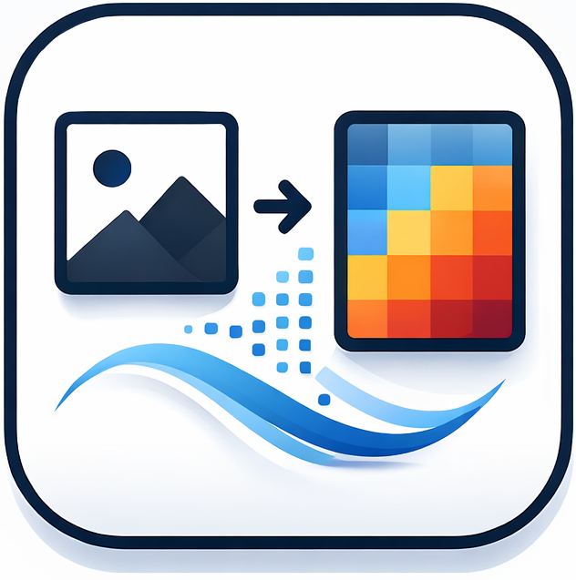
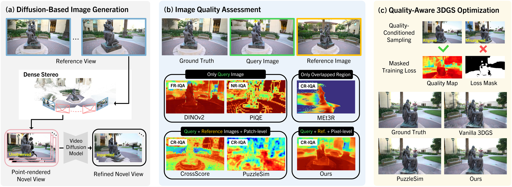
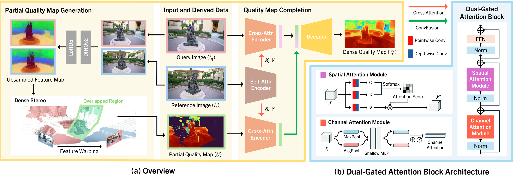

#  PR-IQA: Partial-Reference Image Quality Assessment

<p align="center">
  <a href="https://kakaomacao.github.io/pr-iqa-project-page/"></a>
  <a href="#"></a>
</p>

<p align="center">
  
</p>

Dense per-pixel quality assessment for generated images using partial 3D references.

**Input**: query image (generated) + reference image
**Output**: dense quality map (per-pixel score in [0, 1])

The pipeline internally generates a partial quality map via FeatureMetric (DINOv2 + VGGT + PyTorch3D), then feeds it into the PR-IQA network to produce the final dense quality map.

## Architecture

PR-IQA is a 3-input U-Net encoder-decoder with cross-attention (59.2M parameters).

<p align="center">
  
</p>

- **Encoder**: 4 levels (48 → 96 → 192 → 384), TransformerLikeBlocks with ChannelAttention + xformers Attention + FFN
- **Decoder**: 3 levels with skip connections from the generated image encoder
- **Output**: sigmoid-activated per-pixel quality map

Each input is accompanied by a 4-scale mask pyramid (whole → half → quarter → tiny) for mask-aware processing.

## Setup

```bash
git clone https://github.com/Kakaomacao/PR-IQA.git
cd PR-IQA

# Create environment
conda create -n priqa python=3.10 -y
conda activate priqa

# Install PyTorch (adjust for your CUDA version)
pip install torch==2.6.0 torchvision==0.21.0 torchaudio==2.6.0 --index-url https://download.pytorch.org/whl/cu124

# Install PyTorch3D (>=0.7.0)
pip install "git+https://github.com/facebookresearch/pytorch3d.git" --no-build-isolation

# Install PR-IQA package
pip install -e .
```

## Quick Start

### Inference (single image)

```bash
python inference.py \
    --checkpoint checkpoints/priqa_base.pt \
    --generated examples/generated.png \
    --reference examples/reference.png \
    --output output/quality_map.png
```

### Inference (batch)

```bash
python scripts/run_quality_pipeline.py \
    --generated_dir /path/to/generated_images \
    --reference_dir /path/to/reference_images \
    --checkpoint checkpoints/priqa_base.pt \
    --output_dir output/
```

Output structure:

```
output/
├── partial_map/    # Internally generated partial quality maps
├── partial_mask/   # Overlap masks
└── quality_map/    # Final dense quality maps (from PR-IQA)
```

### Python API

```python
from inference import load_model, predict_quality_map

model = load_model("checkpoints/priqa_base.pt", device="cuda")

# quality_map: np.ndarray (H, W), values in [0, 1]
quality_map = predict_quality_map(
    model, generated_img, reference_img, device="cuda"
)
```

## Gradio Demo

An interactive web demo is available via Gradio. Upload a query image and a reference image to run the full pipeline (FeatureMetric partial map generation → PR-IQA dense quality map inference).

```bash
# Install Gradio (if not already installed)
pip install gradio

# Launch the demo
python gradio_app.py --checkpoint checkpoints/priqa_base.pt
```

Options:

```bash
python gradio_app.py \
    --checkpoint checkpoints/priqa_base.pt \
    --device auto \
    --use-loftup \
    --server-name 0.0.0.0 \
    --server-port 7860 \
    --share                  # Create a public Gradio link
```

## Training

```bash
# Single GPU
python train.py \
    --root /path/to/training_data \
    --ckpt_dir checkpoints/ \
    --epochs 3 --batch_size 8 --lr 1e-4

# Multi-GPU (DDP)
torchrun --nproc_per_node=4 train.py \
    --root /path/to/training_data \
    --ckpt_dir checkpoints/ \
    --epochs 3 --batch_size 8 --lr 1e-4
```

### Training Data Structure

```
training_data/
├── scene_001/
│   ├── diffusion/         # Generated / distorted images (RGB)
│   ├── gt/                # Ground-truth reference images (RGB)
│   ├── partial_map/       # Partial quality maps (grayscale)
│   └── partial_mask/      # Overlap masks (grayscale)
├── scene_002/
│   └── ...
```

### Loss Function

| Loss      | Weight | Description                                                          |
| --------- | ------ | -------------------------------------------------------------------- |
| JSD       | 1.0    | Jensen-Shannon divergence between predicted and target distributions |
| Masked L1 | 0.5    | L1 loss weighted by the overlap mask                                 |
| Pearson   | 0.25   | Pearson correlation coefficient (structural similarity)              |

## Partial Map Generation

Partial quality maps are automatically generated internally via FeatureMetric (DINOv2 + VGGT + PyTorch3D) during inference. No separate step is required.

For generating training data offline, you can use the standalone script:

```bash
python scripts/generate_partial_maps.py \
    --scene_dir /path/to/scene \
    --output_dir /path/to/output
```

Requires `vggt` and `loftup` submodules:

```bash
git submodule update --init --recursive
```

## Project Structure

```
PR-IQA/
├── pr_iqa/
│   ├── model/
│   │   ├── layers.py          # PartialConv2d, TransformerLikeBlock, Attention, ...
│   │   └── priqa.py           # PRIQA model (59.2M params)
│   ├── partial_map/
│   │   └── feature_metric.py  # DINOv2 + LoftUp + VGGT → partial quality map
│   ├── loss.py                # JSD, masked L1, Pearson, ranking losses
│   ├── transforms.py          # ImageNet normalization, mask pyramids
│   └── dataset.py             # SceneDataset with augmentation
├── train.py                   # DDP training script
├── inference.py               # Single / batch inference
├── gradio_app.py              # Interactive Gradio web demo
├── scripts/
│   ├── generate_partial_maps.py
│   └── run_priqa_pipeline.py
├── configs/
│   └── default.yaml
├── assets/
│   ├── F1_Main.png            # Main figure
│   ├── pr-iqa.png             # Logo
│   ├── favicon.ico            # Favicon
│   └── airlab.png
├── checkpoints/
│   └── priqa_base.pt
└── submodules/
    ├── loftup/
    └── vggt/
```

## Configuration

See [`configs/default.yaml`](configs/default.yaml) for all hyperparameters.

Key defaults:

| Parameter              | Value        |
| ---------------------- | ------------ |
| Base dim               | 48           |
| Encoder blocks         | [2, 3, 3, 4] |
| Attention heads        | [1, 2, 4, 8] |
| Learning rate          | 1e-4         |
| AMP dtype              | bfloat16     |
| Input size (train)     | 224          |
| Input size (inference) | 256          |

## Requirements

- PyTorch >= 2.0
- torchvision >= 0.15
- einops >= 0.7.0
- xformers >= 0.0.22
- pytorch3d >= 0.7.0
- gradio (for web demo)
- vggt (submodule)
- loftup (submodule)

## Acknowledgements

This research was supported by the MSIT (Ministry of Science and ICT), Korea, under the ITRC (Information Technology Research Center) support program (IITP-2026-RS-2020-II201789), and the Artificial Intelligence Convergence Innovation Human Resources Development (IITP-2026-RS-2023-00254592) supervised by the IITP (Institute for Information & Communications Technology Planning & Evaluation).

## License

This project is licensed under the [Apache License 2.0](LICENSE).

Note: Submodule dependencies (`vggt`, `loftup`) are subject to their own respective licenses.
